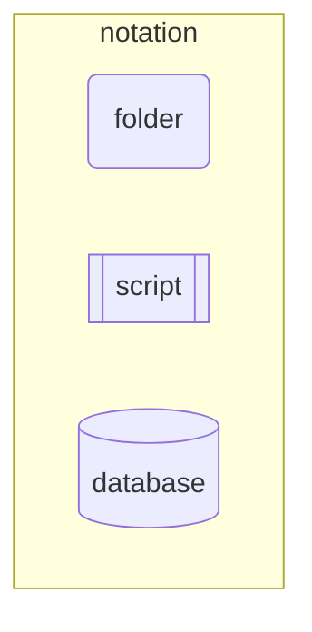
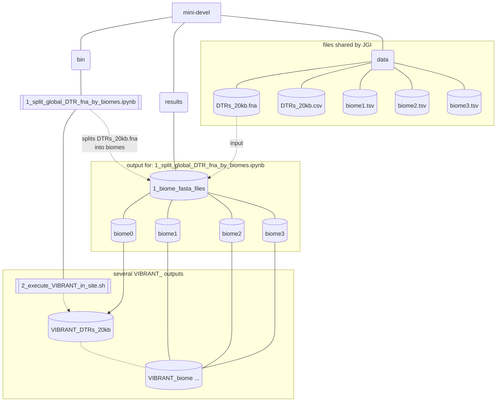

# mini-devel

```mermaid
flowchart TD
    subgraph ide1 [notation]
    B(folder)
    C[[script]]
    D[(database)]
    end


```
Development repo for the miniphages project

```mermaid
flowchart TD
    A[mini-devel] --- B(bin)
    A --- R(results)
    A --- D(data)

    B --- B1[[1_split_global_DTR_fna_by_biomes.ipynb]] --- B2[[2_execute_VIBRANT_in_site.sh]]

    B1 -.-> |splits DTRs_20kb.fna\ninto biomes| R1

    D1 -.-> |input| R1

    subgraph ide1 [files shared by JGI]
    D --- D1[(DTRs_20kb.fna)]
    D --- D2[(DTRs_20kb.csv)]
    D --- D3[(biome1.tsv)]
    D --- D4[(biome2.tsv)]
    D --- D5[(biome3.tsv)]
    end

    R --- R1[(1_biome_fasta_files)]

    subgraph ide2 [output for: 1_split_global_DTR_fna_by_biomes.ipynb]
    R1 --- biome0[(biome0)]
    R1 --- biome1[(biome1)]
    R1 --- biome2[(biome2)]
    R1 --- biome3[(biome3)]
    end

    subgraph ide3 [several VIBRANT_ outputs]
    biome0 ---> vibrant0[(VIBRANT_DTRs_20kb)]
    B2 -.-> vibrant0 -.- vibrant_all
    biome1 --- vibrant_all[(VIBRANT_biome ...)]
    biome2 --- vibrant_all[(VIBRANT_biome ...)]
    biome3 --- vibrant_all[(VIBRANT_biome ...)]
    end
```